# StudyPlanix

A university study-planning web app built for juggling classes, assignments, and (for the
part-time-job crowd) a realistic amount of free time. StudyPlanix tracks your timetable and
assignments, and layers AI on top to turn PDFs you already have — syllabi, slides, lecture
notes — into a study plan, a quiz, or a flashcard deck.

Built with Next.js 16 (App Router, Turbopack), React 19, and Supabase.

## AI in this project

Several features are AI-powered, using the OpenAI API (`gpt-4o-mini`) with structured JSON
output (via `zodResponseFormat`) so the model's output is always validated against a schema
before it touches the database:

- **AI Study Planner** — proposes concrete study sessions around your assignments, exams, and
  class schedule, respecting how much free time you realistically have.
- **PDF timetable import** — extracts text from a syllabus/timetable PDF and parses it into
  structured class sessions for review before import.
- **AI Quiz Generator** — turns a PDF of course material into a mixed quiz (multiple choice,
  true/false, short answer). Short-answer responses are graded by a second AI call that accepts
  paraphrasing rather than requiring an exact match.
- **AI Flashcard Generator** — turns a PDF into a flashcard deck, shown as a grid you can flip
  through in any order.

PDF text extraction itself (via [`unpdf`](https://github.com/unjs/unpdf)) is not AI — only the
structuring/generation step is.

## Features

### Core planning

| | |
|---|---|
| **Dashboard** | At-a-glance view of today's classes, assignments due, upcoming exams, and study streak. |
| **Timetable** | Recurring and one-off class sessions, grouped by course, with tutorial/lab groups. |
| **Assignments** | Track due dates and status across all your courses. |
| **Calendar** | Classes and assignments merged into one calendar view. |
| **Exams** | A dedicated view of upcoming and past exams. |

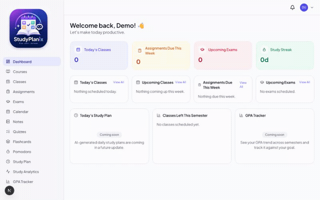
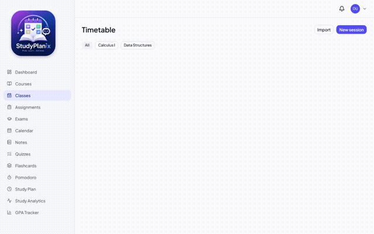
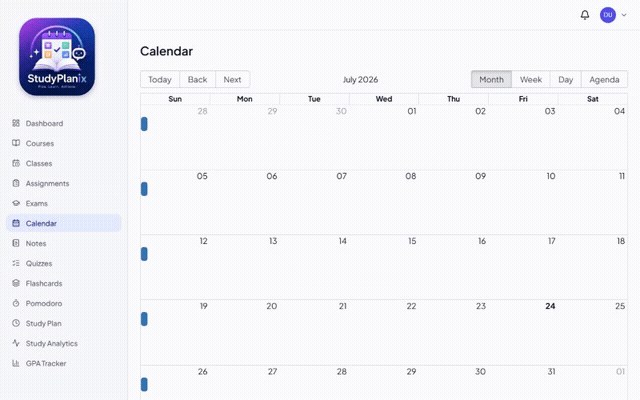
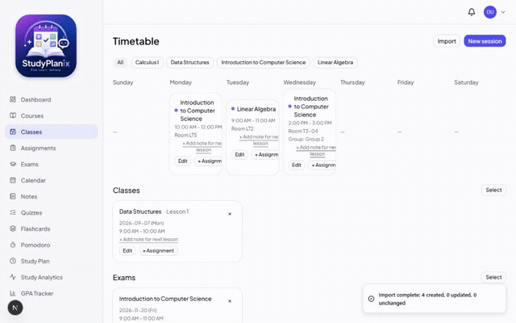

### Importing your existing timetable

Upload an `.ics` calendar export, an `.xlsx`/`.csv` file, or a PDF — all three go through the
same review-before-you-commit flow, so you can fix up course matching before anything is saved.

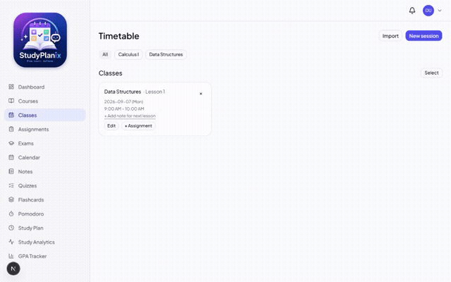

### Notes

A rich-text note editor (bold, italics, highlight, lists) with notes optionally linked to a
course.

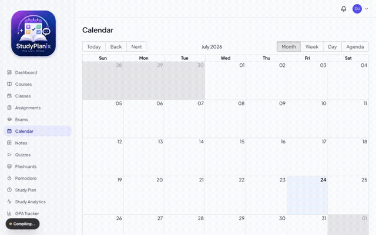

### AI Quiz Generator

Upload a PDF, pick a course and question count, and get a mixed quiz back. Retake it any time —
past scores are tracked per quiz.

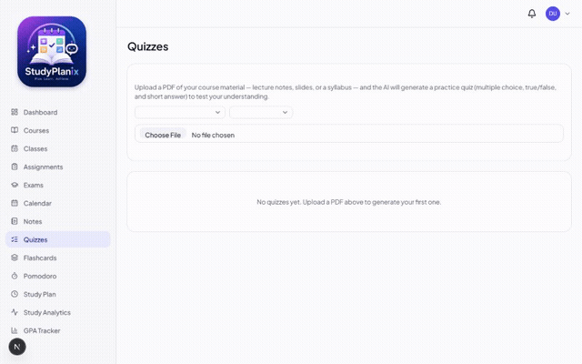

### AI Flashcard Generator

Same upload flow, but produces a flashcard deck. All cards show at once in a grid — click any
card to flip it, in any order you like.

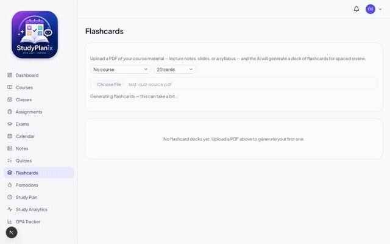

### Pomodoro timer

Configurable focus/break durations, logged per course, feeding into Study Analytics.

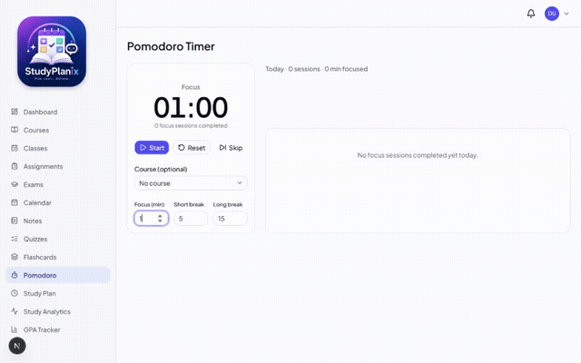

### AI Study Planner

Generates concrete study sessions from your outstanding assignments, exams, and free time.

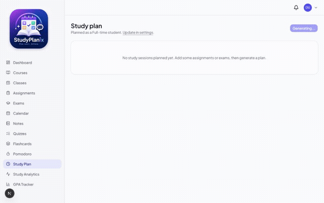

### GPA Tracker

Per-institution grading scales (33 institutions, each with its own accurate max score and grade
table), a custom-scale option, and a GPA growth chart across terms.

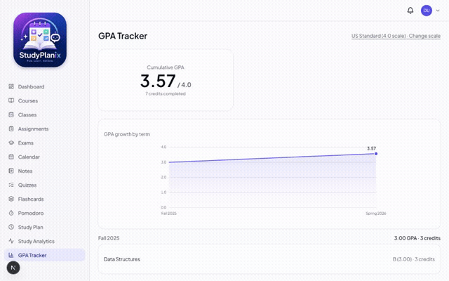

### Study Analytics

Study time, streaks, and assignment completion trends over time.

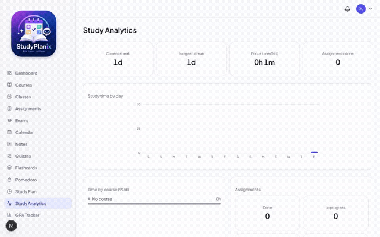

### Also included

- Email reminders for upcoming assignments (via Resend + an hourly Vercel cron job)
- Dark mode
- Account settings: school info, study preferences, grading scale, password change

## Tech stack

- **Framework**: Next.js 16 (App Router, Server Components, Server Actions, Turbopack)
- **UI**: React 19, Tailwind CSS 4, Radix UI, shadcn-style components
- **Database/Auth**: Supabase (Postgres + Row Level Security)
- **AI**: OpenAI API (`gpt-4o-mini`) with Zod-validated structured output
- **Email**: Resend
- **Rich text**: Tiptap
- **Calendar**: react-big-calendar
- **PDF text extraction**: unpdf
- **Testing**: Vitest (unit) + Playwright (end-to-end)

## Getting started

### 1. Install dependencies

```bash
npm install
```

### 2. Set up environment variables

Copy `.env.example` to `.env.local` and fill in:

| Variable | Where to get it |
|---|---|
| `NEXT_PUBLIC_SUPABASE_URL` | Supabase dashboard → Settings → API |
| `NEXT_PUBLIC_SUPABASE_ANON_KEY` | Supabase dashboard → Settings → API |
| `SUPABASE_SERVICE_ROLE_KEY` | Supabase dashboard → Settings → API (server-only — never expose to the browser) |
| `RESEND_API_KEY` | [resend.com](https://resend.com) dashboard → API Keys |
| `CRON_SECRET` | Any long random string you generate — protects the reminders cron route |
| `OPENAI_API_KEY` | [platform.openai.com](https://platform.openai.com) |

### 3. Set up the database

Apply the migrations in `supabase/migrations/` to your Supabase project:

```bash
npx supabase db push
```

Then regenerate the TypeScript types whenever the schema changes:

```bash
npx supabase gen types typescript --project-id <your-project-ref> > src/types/database.types.ts
```

### 4. Run the dev server

```bash
npm run dev
```

Open [http://localhost:3000](http://localhost:3000).

### Testing

```bash
npm run test       # Vitest unit tests
npm run test:e2e   # Playwright end-to-end tests
```

## Deployment

The project includes a `vercel.json` with an hourly cron job for `/api/cron/send-reminders`, so
[Vercel](https://vercel.com) is the natural deploy target — set the same environment variables
in the Vercel project settings and deploy.
